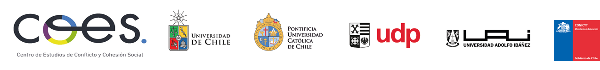
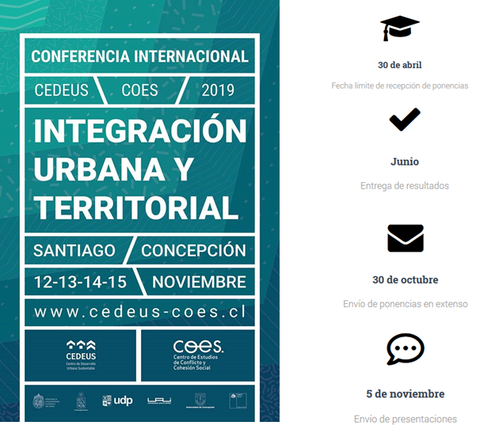
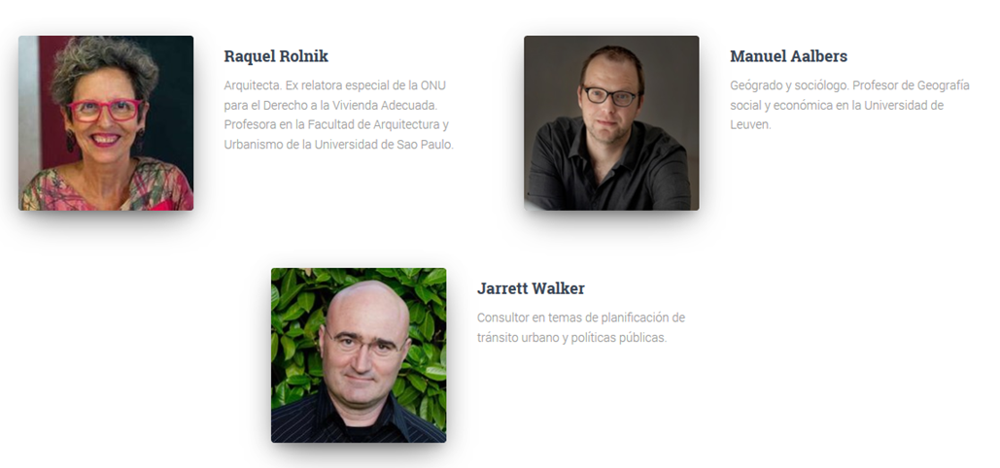
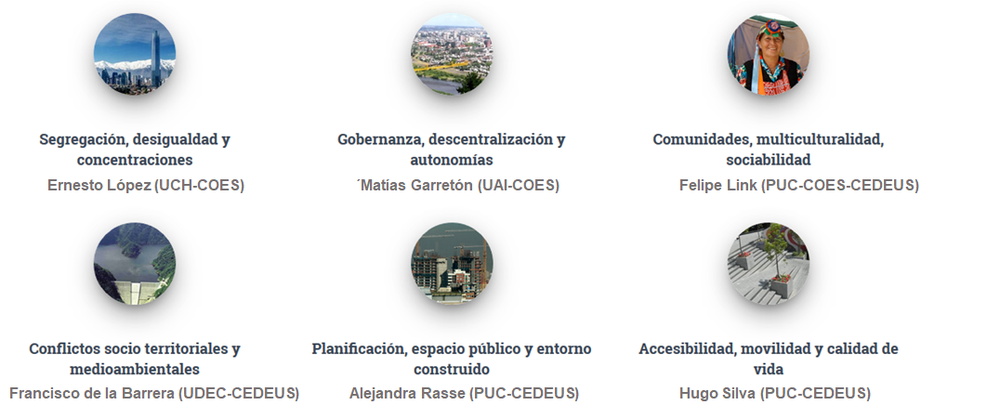
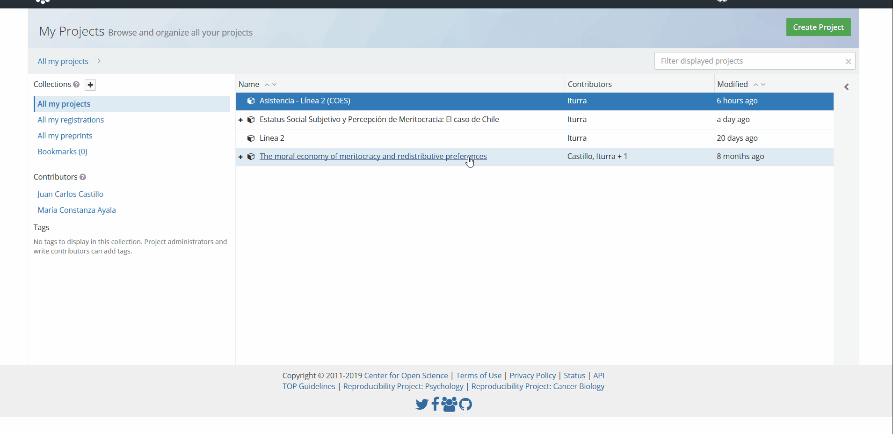
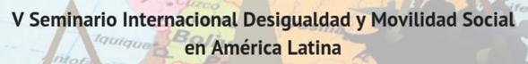
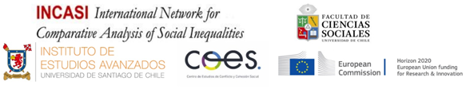

class: just
```{r setup, include=FALSE}
options(htmltools.dir.version = FALSE)
```

# Contenidos reunión

  ---

1. **Informe Proyecciones COES** 

    a. Características del segundo periodo del Centro
    
    b. Objetivos Línea Interacciones Grupales e Individuales

2. **Presentación equipo ELSOC**

3. **Ciencia abierta en COES**

4. **Organización futuras reuniones de línea**

5. **Otros** 

---

class: center, middle, inverse


***
# [Informe Proyecciones]()

## Segundo periodo
***

---
class: just
# Características de COES 2.0 
***

Para el nuevo periodo de **COES** se han trazado cinco tareas propritarias:

#### 1 - Fortalecer la investigación interdisciplinaria.
#### 2 - Cambio Social
#### 3 - Ciencia Abierta
#### 4 - Investigación aplicada y políticas públicas.
#### 5 - Establecimiento de redes de colaboración con instituciones nacionales e internacionales.

---
class: center, middle

***
# Estudio Longitudinal Social de Chile

### [Planificación 2019]()
***
```{r echo=FALSE, out.width='100%'}

```


---
class: just
# Cronograma 2019


|    Actividad                                                                  |    Fecha          |
|:-------------------------------------------------------------------------------|:-------------------|
|    Entrega de Base de datos ELSOC 2018 (Corte   Transversal)                  |    9 de Abril     |
|    Entrega   de Documentación   ELSOC 2018 (Corte Transversal)                |    12 de Abril    |
|    Entrega   de Base   de Datos ELSOC 2016-2018 (Longitudinal)                |    17 de Abril    |
|    Actualización de Repositorio ELSOC   (Ola 2017 a todo el público)          |    26 de Abril    |
|    Envío de 1ra Versión del Cuestionario   ELSOC 2019 a Centro MicroDatos     |    17 de Mayo     |
|    Inicio de Trabajo de Campo ELSOC 2019 (fecha tentativa)                    |    5 de Agosto    |

---
class: just

#Cambios en ELSOC 2019

* La entrega de los datos de **ELSOC** para los investigadores COES será por medio de una plataforma web.

* La liberación pública de los datos de ELSOC se realizará por medio del repositorio en **Dataverse Project.**

* El equipo ELSOC iniciará durante Abril la revisión del Cuestionario 2019. Se opera bajo el escenario de repetir el cuestionario 2017 (sin cambios). En caso de que hayan modificaciones, se comunicará a los investigadores en su debido momento el modo en que se implementarán.

* Resultados de Encuesta de Usos de ELSOC nos han permitido identificar necesidades y oportunidades para la planificación de actividades durante 2019.

---

class: just
#Actividades Públicas ELSOC 2019 

* COES desarrollará diversas actividades relacionadas a los datos de ELSOC:

  1. Lanzamientos públicos de resultados de ELSOC (formato 
  2. Workshops y Talleres de Capacitación con datos de ELSOC.
  3. Seminario de Investigación con ELSOC.
  
* Se necesita colaboración por parte de las líneas para desarrollar presentaciones de resultados de ELSOC. Cada línea debe coordinar una propuesta de presentación (temas de presentación, encargados, fechas tentativas) con Benjamín y Alejandro. Un objetivo transversal de COES 2.0 es el desarrollo de actividades fuera de la Región Metropolitana.
---

# Conferencia CEDEUS - COES


```{r echo=FALSE, out.width='75%', fig.align='center'}

```
---
# Conferencia CEDEUS - COES
### Keynote speakers confirmados

```{r echo=FALSE, out.width='100%', fig.align='center'}

```

---
# Conferencia CEDEUS - COES
###Ejes de la conferencia

```{r echo=FALSE, out.width='110%', fig.align='center'}

```


---
class: inverse, center, middle

***
# [Ciencia Abierta]()
***

---
class: just

# Aspectos generales

Dentro de las cinco tareas para el nuevo periodo de COES, promover una agenda de **Ciencia Abierta** tiene la potencialidad de contribuir al fortalecimiento de las Redes de Colaboración y establecer un diálogo más fluido con investigadores/as de otras instituciones académicas del contexto nacional e internacional.


* Fortalecer la Investigación Interdisciplinaria
* Análisis del Cambio Social.
* [Ciencia Abierta.]()
* Investigación Aplicada.
* Redes de Colaboración.


Para esto, se busca impulsar una lógica de trabajo basada en los princios de _**Reproducibilidad**_, _**Apertura**_ y _**Transparencia**_.


---

class: inverse, center, middle
***
# [Propuesta de trabajo]()
***
---

class: just

<br> 
En consonancia con el apartado anterior, se ha elaborado una propuesta de trabajo basada en el entorno de colaboración académica que ofrece el [*Open Science Framework*](https://osf.io/).    

El _**Open Science Framework**_ es una plataforma de gestión de proyectos **gratuito** y **abierto** que facilita la colaboración a las y los investigadores a lo largo de todo el ciclo de investigación.


```{r echo=FALSE, fig.align='center', out.width='60%', fig.cap="<strong> Fig. 1: </strong>  Flujo de trabajo e Integración del Open Science Framework"}
knitr::include_graphics("images/osfint.png")
```


---
class: middle, center, inverse

## Gestión de un proyecto

```{r echo=FALSE, fig.align='center', out.width='200%', fig.cap="<strong> Fig. 2: </strong>  Secciones de un proyecto "}

```

[Asistencia - Línea 2 (COES)](https://osf.io/gjfvm/)

---
class: middle, center 


```{r echo=FALSE, fig.align='center', out.width='110%'}

```

***

6 - 8 de mayo 2019

## **Instituto de Estudios Avanzados**

## Universidad de Santiago

Román Díaz 89, Providencia, Santiago

```{r echo=FALSE, fig.align='center', out.width='75%'}

```


---

# Cronograma

<table style="border-collapse:collapse;border-spacing:0;border-color:#ccc" class="tg"><tr><th style="font-family:Georgia, serif !important;;font-size:14px;font-weight:bold;padding:10px 5px;border-style:solid;border-width:0px;overflow:hidden;word-break:normal;border-top-width:1px;border-bottom-width:1px;border-color:inherit;color:#333;background-color:#f0f0f0;text-align:center;vertical-align:top"></th><th style="font-family:Georgia, serif !important;;font-size:14px;font-weight:bold;padding:10px 5px;border-style:solid;border-width:0px;overflow:hidden;word-break:normal;border-top-width:1px;border-bottom-width:1px;border-color:inherit;color:#333;background-color:#f0f0f0;text-align:center;vertical-align:top">Lunes 6</th><th style="font-family:Georgia, serif !important;;font-size:14px;font-weight:bold;padding:10px 5px;border-style:solid;border-width:0px;overflow:hidden;word-break:normal;border-top-width:1px;border-bottom-width:1px;border-color:inherit;color:#333;background-color:#f0f0f0;text-align:center;vertical-align:top">Martes 7</th><th style="font-family:Georgia, serif !important;;font-size:14px;font-weight:bold;padding:10px 5px;border-style:solid;border-width:0px;overflow:hidden;word-break:normal;border-top-width:1px;border-bottom-width:1px;border-color:inherit;color:#333;background-color:#f0f0f0;text-align:center;vertical-align:top">Miércoles 8</th></tr><tr><td style="font-family:Georgia, serif !important;;font-size:14px;padding:10px 5px;border-style:solid;border-width:0px;overflow:hidden;word-break:normal;border-top-width:1px;border-bottom-width:1px;border-color:inherit;color:#333;background-color:#fff;font-weight:bold;text-align:left;vertical-align:top">09:00 - 11:00</td><td style="font-family:Georgia, serif !important;;font-size:14px;padding:10px 5px;border-style:solid;border-width:0px;overflow:hidden;word-break:normal;border-top-width:1px;border-bottom-width:1px;border-color:inherit;color:#333;background-color:#fff;text-align:left;vertical-align:top">Inscripciones</td><td style="font-family:Georgia, serif !important;;font-size:14px;padding:10px 5px;border-style:solid;border-width:0px;overflow:hidden;word-break:normal;border-top-width:1px;border-bottom-width:1px;border-color:inherit;color:#333;background-color:#fff;text-align:left;vertical-align:top">Mesas simultáneas</td><td style="font-family:Georgia, serif !important;;font-size:14px;padding:10px 5px;border-style:solid;border-width:0px;overflow:hidden;word-break:normal;border-top-width:1px;border-bottom-width:1px;border-color:inherit;color:#333;background-color:#fff;text-align:left;vertical-align:top">Mesas simultáneas</td></tr><tr><td style="font-family:Georgia, serif !important;;font-size:14px;padding:10px 5px;border-style:solid;border-width:0px;overflow:hidden;word-break:normal;border-top-width:1px;border-bottom-width:1px;border-color:inherit;color:#333;background-color:#fff;font-weight:bold;text-align:left;vertical-align:top">11:00 - 13:00</td><td style="font-family:Georgia, serif !important;;font-size:14px;padding:10px 5px;border-style:solid;border-width:0px;overflow:hidden;word-break:normal;border-top-width:1px;border-bottom-width:1px;border-color:inherit;color:#333;background-color:#fff;text-align:left;vertical-align:top">Conferencia Inaugural</td><td style="font-family:Georgia, serif !important;;font-size:14px;padding:10px 5px;border-style:solid;border-width:0px;overflow:hidden;word-break:normal;border-top-width:1px;border-bottom-width:1px;border-color:inherit;color:#333;background-color:#fff;text-align:left;vertical-align:top">Conferencia Internacional: Dayma Echevarria</td><td style="font-family:Georgia, serif !important;;font-size:14px;padding:10px 5px;border-style:solid;border-width:0px;overflow:hidden;word-break:normal;border-top-width:1px;border-bottom-width:1px;border-color:inherit;color:#333;background-color:#fff;text-align:left;vertical-align:top">Conferencia Internacional: Patricio Solis</td></tr><tr><td style="font-family:Georgia, serif !important;;font-size:14px;padding:10px 5px;border-style:solid;border-width:0px;overflow:hidden;word-break:normal;border-top-width:1px;border-bottom-width:1px;border-color:inherit;color:#333;background-color:#fff;font-weight:bold;text-align:left;vertical-align:top">15:00 - 17:00</td><td style="font-family:Georgia, serif !important;;font-size:14px;padding:10px 5px;border-style:solid;border-width:0px;overflow:hidden;word-break:normal;border-top-width:1px;border-bottom-width:1px;border-color:inherit;color:#333;background-color:#fff;text-align:left;vertical-align:top">Mesas simultáneas</td><td style="font-family:Georgia, serif !important;;font-size:14px;padding:10px 5px;border-style:solid;border-width:0px;overflow:hidden;word-break:normal;border-top-width:1px;border-bottom-width:1px;border-color:inherit;color:#333;background-color:#fff;text-align:left;vertical-align:top">Mesas simultáneas</td><td style="font-family:Georgia, serif !important;;font-size:14px;padding:10px 5px;border-style:solid;border-width:0px;overflow:hidden;word-break:normal;border-top-width:1px;border-bottom-width:1px;border-color:inherit;color:#333;background-color:#fff;text-align:left;vertical-align:top">Mesas simultáneas</td></tr><tr><td style="font-family:Georgia, serif !important;;font-size:14px;padding:10px 5px;border-style:solid;border-width:0px;overflow:hidden;word-break:normal;border-top-width:1px;border-bottom-width:1px;border-color:inherit;color:#333;background-color:#fff;font-weight:bold;text-align:left;vertical-align:top">17:30 - 18:30</td><td style="font-family:Georgia, serif !important;;font-size:14px;padding:10px 5px;border-style:solid;border-width:0px;overflow:hidden;word-break:normal;border-top-width:1px;border-bottom-width:1px;border-color:inherit;color:#333;background-color:#fff;text-align:left;vertical-align:top">Conferencia Internacional:&nbsp;&nbsp;Sandra Fachelli</td><td style="font-family:Georgia, serif !important;;font-size:14px;padding:10px 5px;border-style:solid;border-width:0px;overflow:hidden;word-break:normal;border-top-width:1px;border-bottom-width:1px;border-color:inherit;color:#333;background-color:#fff;text-align:center;vertical-align:top">-</td><td style="font-family:Georgia, serif !important;;font-size:14px;padding:10px 5px;border-style:solid;border-width:0px;overflow:hidden;word-break:normal;border-top-width:1px;border-bottom-width:1px;border-color:inherit;color:#333;background-color:#fff;text-align:center;vertical-align:top">-</td></tr></table>


